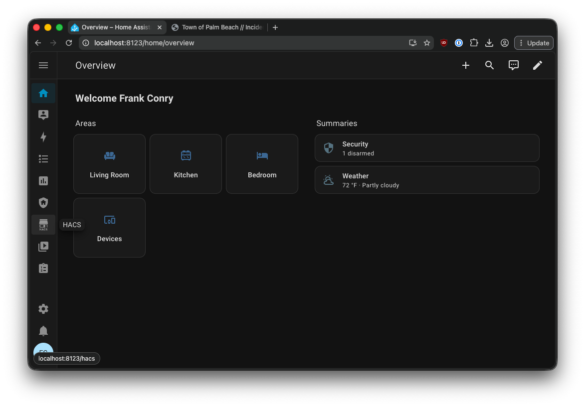
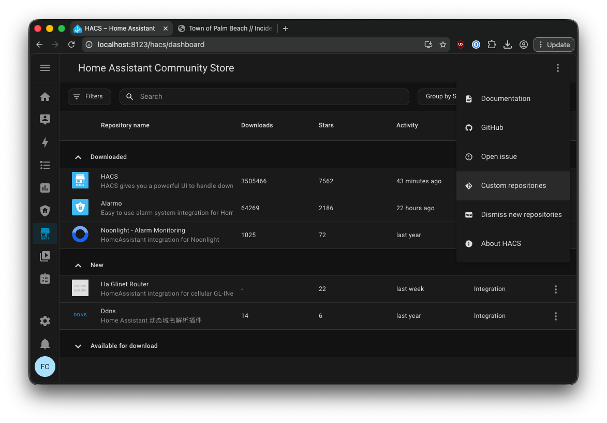
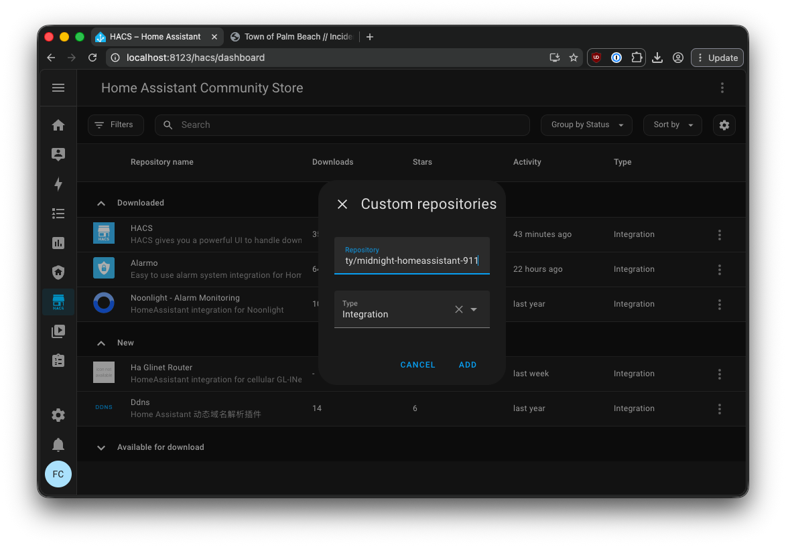
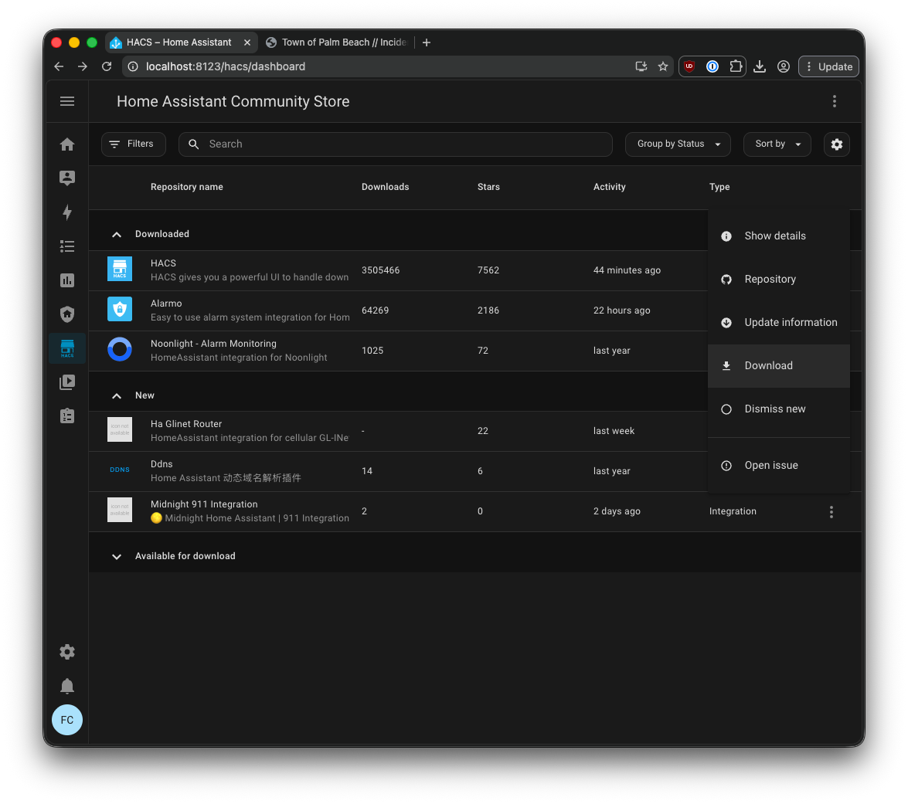
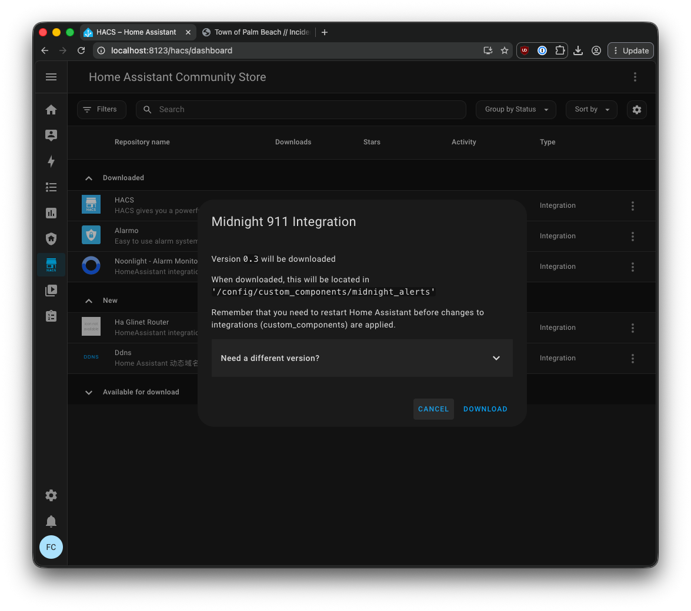
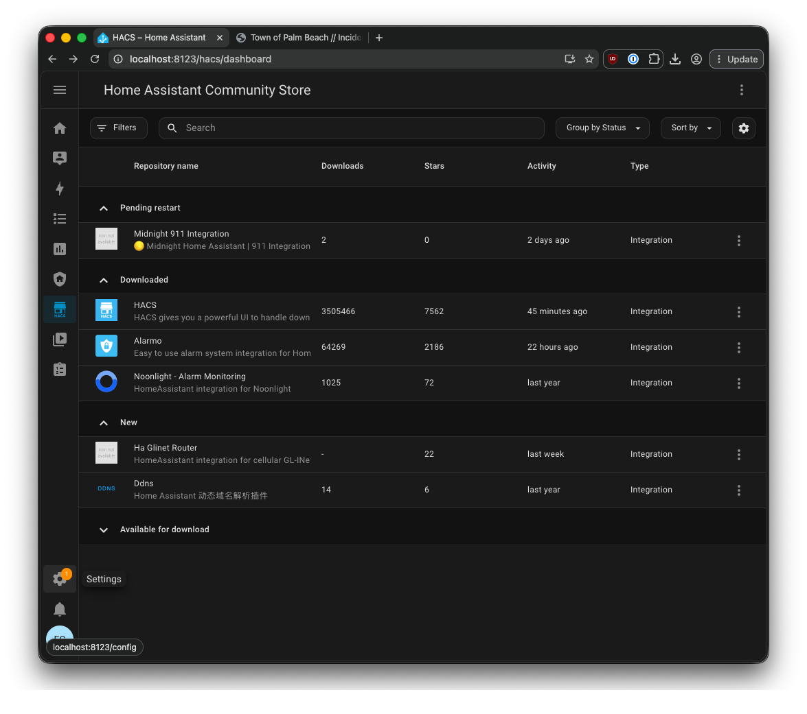
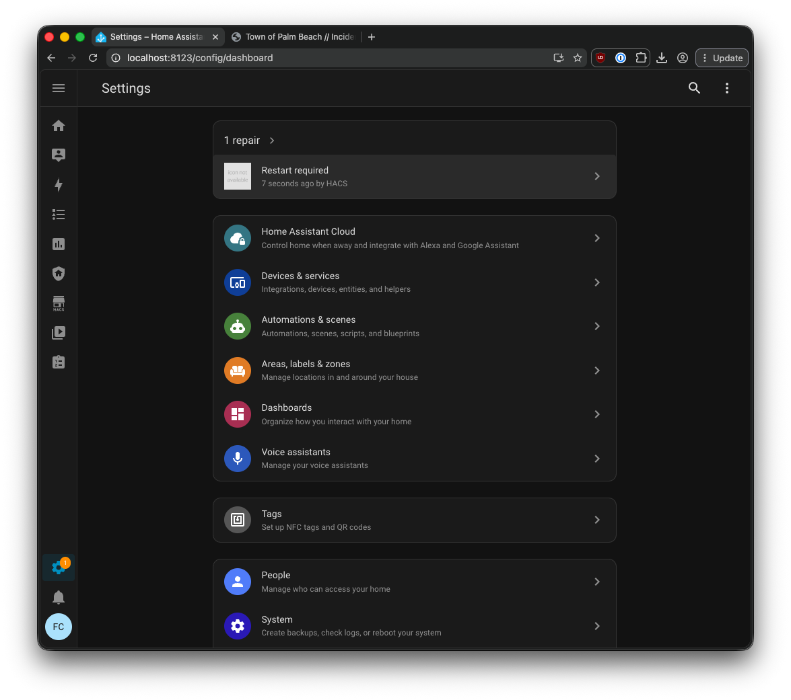
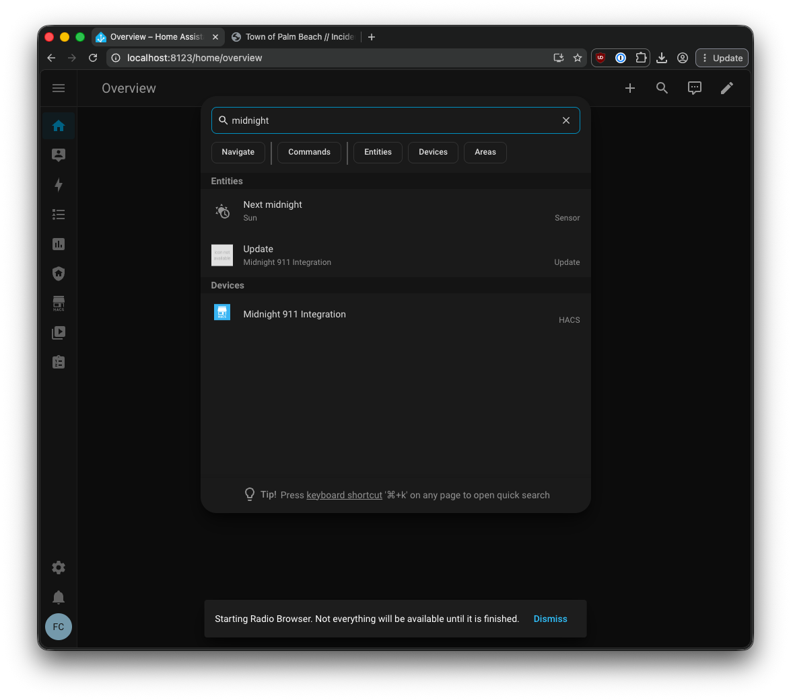

# Midnight 911 for Home Assistant

[](https://github.com/midnight-security/ha-midnight-noo/actions/workflows/ha_and_hacs_validate.yml)
[](https://github.com/hacs/integration)

The Midnight 911 integration for Home Assistant allows anyone to add professional security monitoring to their home.

Users can add either a button or automation that triggers an alert to a US-based security monitoring center. If validated or without response, they will contact your local 911 center on your behalf. So please use it carefully.

HACS is required, currently.

> **Note:** This integration is currently available in the United States only, with plans to expand to Canada.

---

## How it Works


This integration works in partnership with RapidSOS and uses their service to validate 911 calls and reach the associated 911 center.

It's VERY IMPORTANT you keep the address updated properly.

---

## Installation

### HACS (Recommended)

1. Open HACS in your Home Assistant instance 
2. Click on the three dots menu and choose "Custom Repository" 
3. Enter the url for this repo in the dialog and click Add 
4. Now hit cancel on the dialog, the integration should appear in "New" 
5. Click "Download" under the three dot menu. 
6. The integration should now appear in "Pending Restart" 
7. In Settings the restart button should be at the top. 
8. After restarting the integration should be available if you search for it from the dashbaord. 

### Manual

1. Copy the `custom_components/midnight_alerts` folder to your Home Assistant `custom_components` directory
2. Restart Home Assistant

---

## Warnings & Disclaimers

Home Assistant must have an active internet connection for the integration to work properly.

NO GUARANTEE
This integration is provided as-is without warranties of any kind. Home Assistant and Midnight both involve multiple service providers and potential points of failure, including (but not limited to) your internet service provider, 3rd party hosting services such as Amazon Web Services, and the Home Assistant software platform.

Please read and understand the [Midnight Terms of Service](https:www.midnight.security/legal) and [Home Assistant Terms of Service](https://www.home-assistant.io/tos/) both of which include important limitations of liability and indemnification provisions.

---

## Development

### Branch workflow

- **`develop`** — active development branch
- **`master`** — production branch; merges here trigger releases

Work happens on `develop`. When ready, open a PR to merge `develop` → `master`.

### Releases & versioning

Releases are automated with [semantic-release](https://github.com/semantic-release/semantic-release) via the [Release](.github/workflows/release.yml) workflow. When a push to `master` includes releasable commits, the workflow:

1. Bumps the version in `package.json` and `custom_components/midnight_alerts/manifest.json`
2. Builds `midnight_alerts.zip` and attaches it to a GitHub Release (for HACS)
3. Commits the version bump to **`master`**
4. Merges **`master`** back into **`develop`** via [`semantic-release-backmerge`](https://github.com/saitho/semantic-release-backmerge)

```
develop → PR → master → semantic-release → version commit on master → back-merge into develop
```

To preview the next release locally:

```bash
yarn install
yarn semantic-release --dry-run   # must be on master
```

### Commit messages

This project uses [Conventional Commits](https://www.conventionalcommits.org/). The commit prefix determines the version bump:

| Prefix | Version bump | Example |
|--------|--------------|---------|
| `fix:` | Patch (`0.4.0` → `0.4.1`) | `fix: handle API timeout` |
| `feat:` | Minor (`0.4.0` → `0.5.0`) | `feat: add automation trigger` |
| `feat!:` or `BREAKING CHANGE:` | Major (`0.4.0` → `1.0.0`) | `feat!: change alert payload` |
| `chore:`, `docs:`, etc. | No release | `docs: update install steps` |

Only commits with `fix:`, `feat:`, or breaking changes trigger a new release.

---

## Third-party code

This project vendors code from [Alarmo](https://github.com/nielsfaber/alarmo)
(© nielsfaber, Apache-2.0) under `custom_components/midnight_alerts/vendor/alarmo/`.
See [THIRD_PARTY_NOTICES.md](THIRD_PARTY_NOTICES.md) for full attribution,
license, and provenance details.

---

## License

Copyright 2026 Midnight Security, Inc.

Licensed under the Apache License, Version 2.0 (the "License");
you may not use this file except in compliance with the License.
You may obtain a copy of the License at

    http://www.apache.org/licenses/LICENSE-2.0

Unless required by applicable law or agreed to in writing, software
distributed under the License is distributed on an "AS IS" BASIS,
WITHOUT WARRANTIES OR CONDITIONS OF ANY KIND, either express or implied.
See the License for the specific language governing permissions and
limitations under the License.
